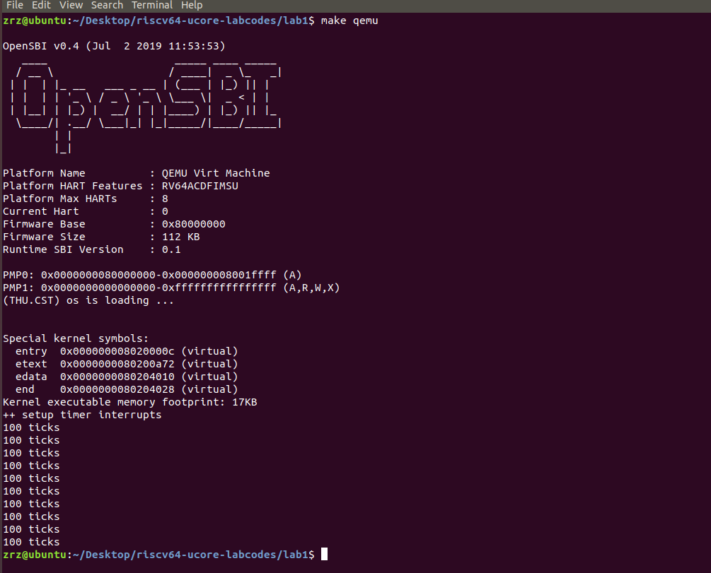

# Lab1: 断, 都可以断
## 练习 1：理解内核启动中的程序入口操作
阅读 kern/init/entry.S 内容代码，结合操作系统内核启动流程，说明指令 la sp, bootstacktop 完成了什么操作，目的是什么？tail kern_init 完成了什么操作，目的是什么？
## Answer:
**la**：用于将一个地址加载到目标寄存器中。在这里，它将 bootstacktop 的地址加载到栈指针寄存器 sp 中。目的是将栈指针初始化为 bootstacktop，也就是内核的启动栈的顶部。这样做是为了确保内核在运行过程中可以使用一个有效的栈来管理函数调用和局部变量。

**tail kern_init**：tail 是一个汇编伪指令，用于将程序的控制流直接转移到 kern_init 函数，而不是通过常规的函数调用/返回机制。kern_init 函数通常是操作系统内核的初始化函数，它在内核启动时执行各种初始化任务，准备好操作系统的运行环境。tail kern_init 的目的是将控制流转移到 kern_init 并开始执行内核初始化。由于使用了 tail 指令，这意味着在执行 kern_init 之后，不会返回到调用者，而是直接开始内核的初始化流程。


综合起来，这两条指令的目的是初始化栈指针，使其指向内核启动栈的顶部，然后直接跳转到内核的初始化代码，开始执行操作系统内核的初始化过程，以确保内核可以正确初始化并准备好执行任务。

## 练习 2：完善中断处理（需要编程）
请编程完善 trap.c 中的中断处理函数 trap，在对时钟中断进行处理的部分填写 kern/trap/trap.c 函数中处理时钟中断的部分，使操作系统每遇到 100 次时钟中断后，调用 print_ticks 子程序，向屏幕上打印一行文字“100 ticks”，在打印完 10 行后调用 sbi.h 中的 shut_down() 函数关机。


要求完成问题 1 提出的相关函数实现，提交改进后的源代码包（可以编译执行），并在实验报告中简要说明
实现过程和定时器中断中断处理的流程。实现要求的部分代码后，运行整个系统，大约每 1 秒会输出一次”
100 ticks”，输出 10 行。
## Answer:
- 改写interrupt_handler函数
```
void interrupt_handler(struct trapframe *tf) {
    intptr_t cause = (tf->cause << 1) >> 1;
    switch (cause) {
        case IRQ_S_TIMER:
            // 处理时钟中断
            clock_set_next_event(); // 设置下次时钟中断
            interrupt_count++; // 增加中断次数
            // 检查是否达到100次时钟中断
            if (interrupt_count >= 100) {
                cprintf("100 ticks\n");
                printed_lines++;
                interrupt_count = 0; // 重置中断计数
                // 检查是否已经打印了10行
                if (printed_lines >= 10) {
                    // 调用关机函数
                    sbi_shutdown();
                }
            }
            break;
        // 其他中断类型的处理...
        // ...
    }
}
```
- 改写print_ticks函数
```
static void print_ticks() {
    cprintf("%d ticks\n", TICK_NUM);
    printed_lines++;
    interrupt_count = 0; // 重置中断计数
    // 检查是否已经打印了10行
    if (printed_lines >= 10) {
        // 调用关机函数
        sbi_shutdown();
    }
}
```
- 执行：`make qemu`，查看结果




## Challenge1：描述与理解中断流程
描述 ucore 中处理中断异常的流程（从异常的产生开始），其中 mov a0，sp 的目的是什么？SAVE_ALL中寄寄存器保存在栈中的位置是什么确定的？对于任何中断，__alltraps 中都需要保存所有寄存器吗？请说明理由。
## Answer:
### 处理中断和异常的流程：
1. **异常产生**：异常可以由多种事件触发，例如除零错误、访问非法内存等。
2. **保存上下文**：在进入异常处理程序之前，处理器通常会将当前的程序状态保存在一组专用寄存器中，这些寄存器保存了引发异常的指令的地址以及异常处理程序返回时的正确位置。
3. **选择异常处理程序**：处理器根据异常的类型和优先级，选择要执行的异常处理程序。在操作系统中，通常有一个中断向量表或异常表，其中包含了不同类型异常的处理程序入口地址。
4. **跳转到异常处理程序**：处理器通过将PC设置为异常处理程序的入口地址，跳转到相应的异常处理程序。这个过程中，异常处理程序可以访问保存在寄存器中的上下文信息，以了解异常的原因和位置。
5. **处理异常**：异常处理程序执行与异常相关的操作，这可能包括识别和解决问题、记录异常信息、切换上下文、保存寄存器状态等。具体操作取决于异常的类型和处理程序的设计。
6. **恢复上下文**：在异常处理程序执行完毕后，通常会将保存的上下文信息（如PC和寄存器状态）恢复到原来的状态，以便返回到中断前的程序执行。
7. **继续执行**：一旦异常处理程序完成，处理器会根据恢复的上下文信息继续执行中断前的程序流程。这通常包括返回到引发异常的指令继续执行。

###  `mov a0, sp` 指令含义
这个指令的目的是将栈指针（SP）的当前值复制到寄存器 `a0` 中。在异常处理过程中，保存和恢复上下文非常重要，而栈指针是上下文的一部分，因为它指示了当前栈帧的位置。将栈指针保存在寄存器 `a0` 中可以在异常处理程序中使用它，以便在需要时访问或修改当前栈帧的信息。

### SAVE_ALL寄存器保存在栈中的位置确定
寄存器保存在栈中的位置是通过计算栈帧的偏移量来确定的，这些偏移量通常根据寄存器的顺序和需要保存的寄存器数量而确定。

### __alltraps 寄存器保存
__alltraps通常不需要保存所有寄存器。保存所有寄存器会占用大量的栈空间和执行时间，因此通常只保存一部分关键寄存器，而不是全部。例如，不保存临时寄存器。

## Challenge2：理解上下文切换机制
在 trapentry.S 中汇编代码 csrw sscratch, sp；csrrw s0, sscratch, x0 实现了什么操作，目的是什么？save all里面保存了 stval scause 这些 csr，而在 restore all 里面却不还原它们？那这样 store 的意义何在呢？
## Answer
1.**csrw sscratch, sp**：
   - `csrw` 是一条特权级别的指令，用于将一个通用寄存器的值写入到指定的控制和状态寄存器（CSR）中。在这里，`ssp` 寄存器被写入 `sp` 寄存器的值。
   - 目的是将当前栈指针（`sp`）的值保存到 `ssp` 寄存器中。`ssp` 寄存器通常被用来保存异常处理程序中的临时栈指针，以便在异常处理程序中可以使用栈来保存上下文信息。这是为了避免在异常处理程序中修改了栈指针 `sp` 后，无法正确恢复原来的栈指针值。

2.**csrrw s0, sscratch, x0**：
   - `csrrw` 也是一条特权级别的指令，用于从指定的CSR中读取值，并将新的值写入到相同的CSR中。在这里，它从 `ssp` 寄存器中读取值，并将零写入到 `ssp` 寄存器中。
   - 目的是将 `ssp` 寄存器的值保存在通用寄存器 `s0` 中。通常，`s0` 寄存器被用来保存临时数据，以便在稍后的指令中使用。

两条指令的目的是在异常处理过程中保存当前栈指针到 `ssp` 寄存器，并将 `ssp` 寄存器的值保存在通用寄存器 `s0` 中。这些操作是为了确保异常处理程序能够在处理异常后正确恢复栈指针和上下文，尤其是在递归异常情况下。

3.**restore all不还原的原因**
  - scause中存储的是异常中断的原因和异常中断的类型，而stval中存储的是导致异常指令的附加信息，如缺页信息等。而在异常处理结束后，已经不需要上述异常处理信息，故restore all并不需要将他们恢复。

## Challenge3：完善异常中断
编程完善在触发一条非法指令异常 mret 和，在 kern/trap/trap.c 的异常处理函数中捕获，并对其进行处理，简
单输出异常类型和异常指令触发地址，即“Illegal instruction caught at 0x(地址)”，“ebreak caught at 0x（地址）”
与“Exception type:Illegal instruction”，“Exception type: breakpoint”。
## Answer
- 改写exception_handler函数
```
void exception_handler(struct trapframe* tf) {
    switch (tf->cause) {
    case CAUSE_MISALIGNED_FETCH:
        break;
    case CAUSE_FAULT_FETCH:
        break;
    case CAUSE_ILLEGAL_INSTRUCTION:
        // 非法指令异常处理
        /* LAB1 CHALLENGE3   YOUR CODE :  */
       /*(1)输出指令异常类型（ Illegal instruction）
        *(2)输出异常指令地址
        *(3)更新 tf->epc寄存器
       */
        cprintf("Exception type: Illegal instruction\n");
        cprintf("Illegal instruction caught at 0x%x\n", tf->epc);
        tf->epc += 4;  // Move to the next instruction
        break;
    case CAUSE_BREAKPOINT:
        //断点异常处理
        /* LAB1 CHALLLENGE3   YOUR CODE :  */
        /*(1)输出指令异常类型（ breakpoint）
         *(2)输出异常指令地址
         *(3)更新 tf->epc寄存器
        */
        cprintf("Exception type: Breakpoint\n");  
        cprintf("Breakpoint caught at 0x%x\n", tf->epc);
        tf->epc += 4;  // Move to the next instruction
        break;
    case CAUSE_MISALIGNED_LOAD:
        break;
    case CAUSE_FAULT_LOAD:
        break;
    case CAUSE_MISALIGNED_STORE:
        break;
    case CAUSE_FAULT_STORE:
        break;
    case CAUSE_USER_ECALL:
        break;
    case CAUSE_SUPERVISOR_ECALL:
        break;
    case CAUSE_HYPERVISOR_ECALL:
        break;
    case CAUSE_MACHINE_ECALL:
        break;
    default:
        print_trapframe(tf);
        break;
    }
}
```
在更改后的代码中，首先使用cprintf函数输出指令的异常类型，因为此时的spc寄存器中存储的是异常发生时的地址，故输出spc寄存器的值即为输出了异常指令地址。并在之后更新tf—>epc寄存器的值，因为RISC v架构为32位四字节，故epc+4会指向发生异常指令的下一条指令。
- 在clock.c中添加异常指令
因为在内核启动的过程中一定会调用clock.c文件，故在其中添加异常指令可以保证异常指令被执行。我们添加了两种不同类型的异常指令：Illegal instruction和ebreak。
```
void clock_init(void) {

 //__asm("ebreak");
 //__asm("mret");


    // enable timer interrupt in sie
    set_csr(sie, MIP_STIP);
    // divided by 500 when using Spike(2MHz)
    // divided by 100 when using QEMU(10MHz)
    // timebase = sbi_timebase() / 500;
    clock_set_next_event();

    // initialize time counter 'ticks' to zero
    ticks = 0;

    cprintf("++ setup timer interrupts\n");
}
```
可以看到，我们添加了两条异常指令，若想进行测试，则取消注释，运行make qemu,可以获得异常指令的类型和异常指令的地址。

## 附加的思考
### makefile文件的格式、作用和与RISC v有关的代码
- 格式和作用：
1. makefile文件在开头定义了一系列变量，如项目名称和编译器前缀，定义了一系列目标规则，每个目标规则对应了如何生成对应的目标文件。描述了如何生成目标文件的规则，包括链接、编译过程。在第一次执行make指令时，会根据上述规则和依赖关系进行目标文件的架构，最终生成ucore内核。
- RISC v相关代码：
1. GCCPREFIX := riscv64-unknown-elf-，定义了RISC v架构下的gcc编译器的前缀。
2. QEMU := qemu-system-riscv64，定义了模拟运行RISC v架构的QEMU模拟器的命令。
3. LDFLAGS	:= -m elf64lriscv，这行代码告诉链接器（LD）正在链接的目标文件架构是RISC v架构。

### ums模式的作用和特点
1. U模式：U 模式是 RISC-V 架构中的用户模式，最低权限级别，用于执行用户应用程序。只能访问用户空间的资源。
2. M模式（机器模式）：M 模式是 RISC-V 架构中的机器模式，最高权限级别，用于操作系统内核等特权软件。可以执行所有特权指令，访问所有系统资源。
3. S模式（监管者模式）：S 模式是 RISC-V 架构中的监管者模式，介于 U 模式和 M 模式之间，通常用于操作系统的监管者，如内核模式或超级用户模式。可以执行一部分特权指令，访问一些受限制的系统资源。

### 内部中断和外部中断的意思和区别
1. 内部中断是由程序中的特定指令引起的中断，这些指令会触发操作系统或特定的中断服务程序来执行相应的处理任务。比如系统调用或中断指令。
2. 外部中断是由处理器外部的硬件设备（如定时器、I/O 设备、外部信号等）发出的中断请求引起的。这种中断类型通常由硬件或外部事件触发。

### trapentry.s代码解析
```
__alltraps:
    SAVE_ALL

    move  a0, sp
    jal trap
    # sp should be the same as before "jal trap"

    .globl __trapret
__trapret:
    RESTORE_ALL
    # return from supervisor call
    sret
```
1. __alltraps:是异常处理函数入口。
2. SAVE_ALL是之前定义的宏，将32个通用寄存器和4个状态寄存器的值保存下来。
3. move  a0, sp：将sp栈顶指针寄存器的值赋值给a0,这样在异常处理过程中可以通过读取a0的值知道在哪里出现了异常。
4. jal trap：跳转到trap里，进行异常处理。
5. RESTORE_ALL：恢复原先寄存器的值。
6. 在SAVE时，我们保存了四个状态寄存器的值，但在LOAD时，只恢复了两个。这是因为scause：是发生异常的原因，但异常已经被处理了，故无需恢复。而stval记录的是缺页的异常，而这里并未涉及，故无需恢复。
7. 什么时候主动停止中断：在进行系统调用或者在一个进程的上下文保存时侵犯到另一个进程。